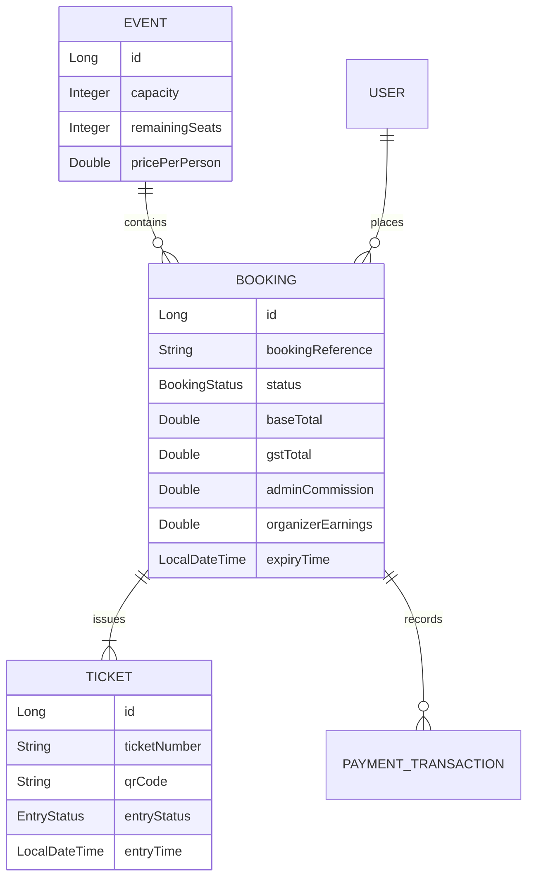

# SEMS Booking System Architecture Blueprint

## 1. System Overview
The SEMS Booking System is designed for high-concurrency event registration, ensuring atomic seat allocation, secure payments with financial breakdown (GST/Commission), and individual ticket verification via QR codes.

## 2. Entity Relationship Model (ERD)

## 3. Booking Lifecycle
1.  **INITIATED**: User selects tickets. Seats are reserved (soft-lock) with an expiry time (e.g., 10 mins).
2.  **PENDING_PAYMENT**: Booking details saved. Redirect to payment gateway.
3.  **CONFIRMED**: Payment successful. Financials calculated. Individual tickets generated.
4.  **EXPIRED**: Payment not received within the window. Seats released.
5.  **CANCELLED**: User or organizer cancels. Refund logic triggered.

## 4. Financial Logic
- **Formula**:
    - `Base Price` = `Event.pricePerPerson * count`
    - `Admin Commission` = `Base Price * AdminConfig.percent`
    - `GST on Commission` = `Admin Commission * 0.18`
    - `Organizer Earnings` = `Base Price - Admin Commission`
    - `User GST (Optional)` = `Base Price * GST_Rate`
    - `Total Payable` = `Base Price + User GST`

## 5. Security & Verification
- **QR Encryption**: QR codes contain a signed JWT or a unique UUID mapped to the ticket.
- **Scan Verification**: Admin mobile app scans QR -> Server validates `status == CONFIRMED` and `entryStatus == NOT_ENTERED`.
- **Concurrency**: Use JPA Optimistic Locking (`@Version`) on `Event.remainingSeats` to prevent overselling.

## 6. Scheduled Tasks
- **BookingExpunger**: Runs every 1 min. Finds `INITIATED` bookings where `expiryTime < now` and transitions them to `EXPIRED`, releasing seats.
- **RevenueAggregator**: Daily job to calculate daily/monthly earnings for Admin Dashboard.
